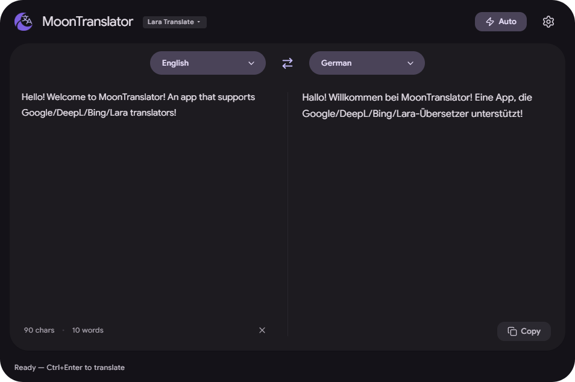
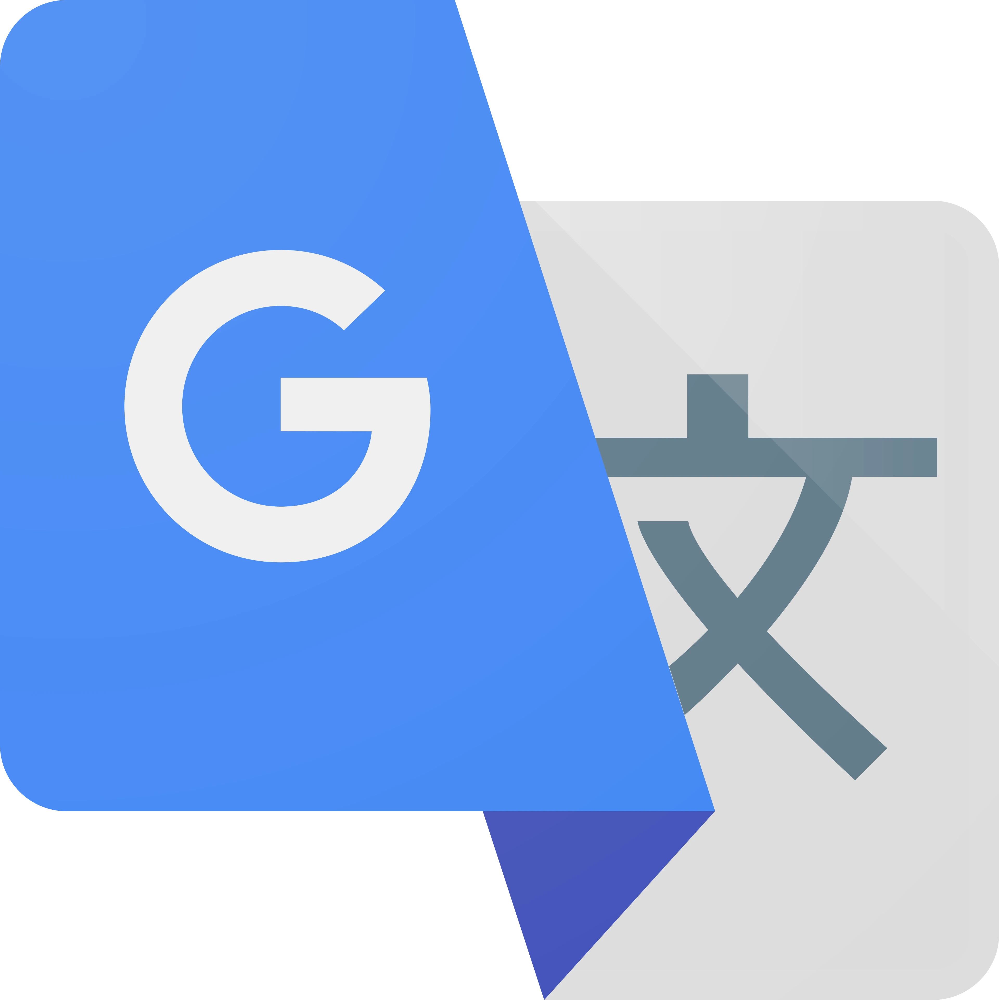

   
   <h1>MoonTranslator</h1>
   
<strong>A beautiful, minimalist, and smart desktop translator that actually gets out of your way.</strong>

   
   
   

    
   
   

---

Hey there! 👋 Welcome to **MoonTranslator**.

I wanted a translation app that just _worked_ without feeling clunky or taking up my entire screen. Something fast, pretty to look at, and smart enough to just translate things where I need them. That's why I built MoonTranslator!

It uses a sleek Material Design 3 interface, lives quietly in your system tray, and pops up exactly when you need it. Plus, since it's built with Rust and Tauri, it uses barely any memory on your PC.

**Note:** _Inspired by [DeepL App](https://www.deepl.com/windows-app)._

## ✨ Why use it?

- **Out of the Box Translation:** Built-in free-tier support for Google Translate and Microsoft Bing without needing any API keys. Or, plug in your own keys for DeepL, Lara Translate, or custom URLs!
- **The "Magic" Popup:** Highlight text anywhere on your PC (Discord, Word, a browser), double-tap `Ctrl+C`, and a mini translator pops right up.
- **Edit & Quick Replace:** Once you translate something in the floating popup, you can manually edit the output. Then, just hit "Replace" and it instantly types the translation back into your document!
- **Instant Language Swap:** Easily reverse the target and source languages with a single button press.
- **Beautiful & Fluid:** Complete with a gorgeous dark/light theme, micro-animations, and smooth window transitions.
- **Auto-Detect & Auto-Translate:** Just paste or type. It figures out the language and translates as you go.

## 🏗️ What's inside?

   
   
   
   
   
   

 

To pull this off, I'm using **React 19** with **Next.js (Static Export)** for a lightning-fast frontend. State is managed by **Zustand**, and the visuals are hand-crafted Vanilla CSS inspired by Material You.
The backend powerhouse driving the window management, global shortcuts, clipboard monitoring, and secure storage is written in **Rust** using **Tauri v2**. 🦀

## 🔑 How to get API Keys

Since MoonTranslator natively supports free built-in translation via Google and Bing, no keys are required to start translating! However, if you want to use DeepL, Lara Translate, or your own official cloud accounts, you'll need to generate a personal API key. Here's a quick guide on where to find them (all major providers offer a generous Free Tier)!

###  DeepL (Recommended)

DeepL provides incredibly accurate, natural-sounding translations. Their free tier covers 500,000 characters/month.

1. Go to the [DeepL API account signup page](https://www.deepl.com/pro-api).
2. Select **DeepL API Free** and create an account.
3. Once logged in, navigate to the **API keys** tab under your Account summary and copy your new Authentication Key.

###  Google Cloud Translation (Optional)

1. Head to the [Google Cloud Console](https://console.cloud.google.com/).
2. Create a new project.
3. In the search bar, look up **Cloud Translation API** and click **Enable**.
4. Go to **APIs & Services** > **Credentials**.
5. Click **Create Credentials** -> **API key** and copy the generated key.

###  Microsoft Bing (Azure Translator) - Optional

1. Go to the [Azure Portal](https://portal.azure.com/).
2. Search for **Translator** in the top bar and click **Create** to launch a new resource.
3. Once your resource is deployed, navigate to it and check the **Keys and Endpoint** section on the left sidebar to find your `Key 1`.

###  Lara Translate

1. Go to the [Lara Translate Credentials page](https://app.laratranslate.com/account/credentials).
2. Generate a new API ID and API Secret.
3. In MoonTranslator, paste them sequentially formatted as `AccessKeyID,AccessKeySecret`.

### Custom URLs

You can also run your own basic local or hosted translation server. Simply enter the full URL (e.g., `http://localhost:5000/translate`) into the Custom API field!

## 📝 License

Feel free to download, study, and fork it! The project is licensed under the GNU General Public License v3.0 (GPL-3.0) - see the [LICENSE](LICENSE) file for details. This ensures the app remains open and free forever.
